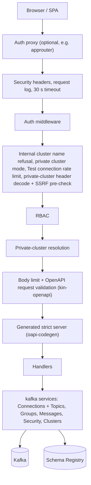

# Architecture

kafkito is one Go binary that serves the React SPA (embedded via
`//go:embed`) and the JSON API under `/api/v1`. It keeps no state of its own:
cluster definitions come from the config file or, for private clusters, from
each request. The stack is described in [ADR-0002](adr/0002-tech-stack.md),
the HTTP contract in [ADR-0005](adr/0005-openapi-contract.md), and the API
from a client's point of view in the [API reference](API.md).

## Request flow

The router is wired in `internal/server/server.go`; `internal/server/api_routes.go`
mounts each generated operation on the middleware chain it needs.

- **Auth** validates the bearer token on every `/api/v1/*` request according
  to `KAFKITO_AUTH_MODE` and answers `401` otherwise; `/healthz` and
  `/readyz` are open. The JWT modes (`mock`, `oidc`, `xsuaa`) load the
  signing keys at startup (a failure only logs a warning) through one shared
  `KeySource` per key URL (`internal/auth/jwks.go`): requests wait at most
  5 s for a load, and a reload runs at most once per minute. Mode `oidc` finds its key URL through
  OpenID Connect discovery unless it is configured, and a failed discovery
  stops startup (`internal/auth/oidc_discovery.go`). The modes, their startup
  and IdP-outage behaviour and the token rules are listed in the README under
  [Auth modes](https://github.com/FinkeFlo/kafkito/blob/main/README.md#auth-modes);
  see also the [API reference](API.md#base-url-and-auth).
- **RBAC** (`internal/rbac`, `internal/server/rbac.go`) maps the matched
  route pattern and method to a `type:action` permission and checks the
  resource name against prefix-glob rules (`*`, `team-*`, or an exact name).
  Path parameters are percent-decoded exactly once, the same way the
  generated binding decodes them, so RBAC and the handler always see the same
  name. A route without a permission is denied unless it is listed in
  `rbacExemptRoutes`, on private clusters too, and a test walks the router
  so every cluster route has one or the other. The topic, group, consumer,
  schema subject and SCRAM user lists are filtered to what the caller may
  view, except on private clusters. With `private_clusters.mode: role` the
  permission `private_cluster:use` decides who may use private clusters
  (see [Private clusters](#private-clusters)).
- **Handlers** implement the generated `StrictServerInterface` and talk to
  the kafka layer through small interfaces (`internal/server/stores.go`).
  `internal/kafka` has one `Connections` core (configs, lazily created
  franz-go clients, ad-hoc clusters) and one service per resource:
  `Topics`, `Groups`, `Messages`, `Security` and `Clusters`.

## Errors

Handlers return errors; one `errorWriter` (`internal/server/apierror.go`)
turns them into responses. Domain sentinel errors (`ErrUnknownCluster`,
`ErrTopicNotFound`, `ErrValueMasked`, …) map to an `apiError` with a fixed
status, code and message; everything else becomes an opaque `500`, and broker
or Schema Registry failures a generic `502 kafka_upstream`, or
`502 private_cluster_address_blocked` when the outbound guard refused a
private cluster's address. The body is always
`{"error": "...", "code": "..."}` (code optional). Only 5xx causes are logged,
server-side. The log line names the cluster (`cluster`) when the route has
one. Messages are static texts or name the failed rule, never the submitted
value, so they never contain credentials, host names or the raw
`X-Kafkito-Cluster` header. Connection failures of private clusters are
reported by class, see
[Outbound connections](#outbound-connections-ssrf-guard).

## OpenAPI as the contract

`api/openapi.yaml` is the single source of truth
([ADR-0005](adr/0005-openapi-contract.md)). `make api-generate` derives the
Go strict server (`internal/server/api/server.gen.go`, oapi-codegen) and the
frontend types (`frontend/src/lib/api.gen.ts`, openapi-typescript);
`make api-check` lints the spec and fails on drift. The same embedded
document drives request validation, and CI rejects breaking changes against
the base branch.

## Frontend data layer

`frontend/src/lib/api-client.ts` is an openapi-fetch client over the
generated types. A single `onRequest` middleware sets `X-Kafkito-Cluster` for
private clusters and `X-Kafkito-Confirm-Prod` for confirmed writes. Reads go
through TanStack Query `queryOptions()` factories in `src/lib/queries/`;
`src/__checks__/query-keys.test.ts` fails on query keys defined anywhere
else. Layout and UI rules are in the [design guidelines](DESIGN_GUIDELINES.md).

## Reading records

Consume, search and the raw download share one iterator,
`Messages.scanRecords` (`internal/kafka/record_source.go`), which reads the
requested offset ranges poll by poll. On topics with a `data_masking` rule the
full decoded value is masked before it is truncated to the 64 KB preview, keys
and header values are masked for rules with those targets, search matches the
masked rendering, and a raw download of a value the rules change is refused
with `403 value_masked`.

## Outbound connections (SSRF guard)

Private clusters point kafkito at user-supplied hosts. `internal/netguard`
guards them twice: a pre-check rejects broker and Schema Registry hosts that
resolve to loopback, link-local (including the cloud metadata endpoint),
multicast or unspecified addresses, and a guarded dialer re-checks every
resolved address at connect time, so DNS rebinding between check and dial
cannot reach them. Private network ranges stay allowed. Configured clusters
are trusted and not guarded.

Kafka clients talk to the addresses brokers advertise in their metadata
(`advertised.listeners`), not only to the configured seeds, and the guarded
dialer applies to those too. A private cluster whose seed is allowed but
whose broker advertises, say, `localhost:39092` therefore passes the
pre-check and fails at the first request that needs that broker. Test
connection (`POST /api/v1/clusters/_test`) catches this: after the seed
answered it sends a request to every advertised broker, in parallel within
the same budget, and reports each blocked or unreachable one in
`broker_issues` with `reachable: false`. Regular requests that hit such a
broker return `502 private_cluster_address_blocked` with a static message
that names no host.

Error texts are fixed: they never name an address, a port, the resolver or
an operating system error. A definition the pre-check refuses gets a `400`
that names the field and the reason, a broker by its 1-based position:
`broker 2: host name could not be resolved`,
`broker 1: destination not allowed` or `schema_registry.url: invalid URL`.
Test connection answers a failed probe with `reachable: false`, the class
of the failure in `error_class` (`internal/connerr`) and the class's text
in `error`:

| Class | Text |
| ----- | ---- |
| `refused` | connection refused |
| `timeout` | connection timed out |
| `dns` | host name could not be resolved |
| `tls` | TLS handshake failed |
| `sasl` | authentication failed |
| `blocked` | destination not allowed |
| `unreachable` | broker not reachable (any other failure) |

Each `broker_issues` entry carries its own class; its `host` and `port` are
the ones the cluster advertises. The full error goes to the server log only.

A cluster definition (the `X-Kafkito-Cluster` header, a Test connection
body, a `dest_cluster_config`) names at most 50 brokers, checked before any
host is resolved; more get `400 too many brokers (max 50)`, prefixed with
the field (`X-Kafkito-Cluster: `, `dest_cluster_config: `) where the
definition is not the body itself. All definitions of one
request share one pre-check (`hostValidatorMiddleware`), which resolves each
distinct host once.

Test connection resolves and dials whatever the caller sends, so it is rate
limited per caller (`internal/server/ratelimit.go`): 10 requests at once,
then one every 6 seconds. A request over the limit gets
`429 rate_limited` with `Retry-After` in whole seconds before the header is
decoded, so it resolves no host. The caller is the verified principal (user
name, else subject) or, without one, the host of the connection's remote
address. No request header counts: the client chooses the RBAC identity
header and `X-Forwarded-For` freely, and kafkito does not rewrite the remote
address from proxy headers. Behind a reverse proxy without authentication,
all callers therefore share the proxy's address and one limit. A caller
that `private_clusters.mode` refuses gets its `403` without counting
against the limit. The limiter forgets a caller once its bucket is full
again and keeps at most 10,000 callers.

## Security headers

Every response carries a strict Content-Security-Policy (`'self'` only, no
inline scripts or styles), `X-Content-Type-Options`, `Referrer-Policy`,
`Cross-Origin-Opener-Policy` and, unless framing is allowed,
`X-Frame-Options` (`internal/server/secheaders.go`). The exact values and the
`frame_ancestors` setting are in the
[README](https://github.com/FinkeFlo/kafkito/blob/main/README.md#security-headers).

## Running behind TLS

kafkito serves plain HTTP only. It has no TLS listener, listens on `:37421`
on all interfaces by default (`KAFKITO_SERVER_ADDR`), and does not send
`Strict-Transport-Security`. API requests carry the user's bearer token, and
every request for a private cluster carries that cluster's broker and Schema
Registry credentials in `X-Kafkito-Cluster`. Over plain HTTP, anyone on the
network path can read them. Run kafkito only behind TLS:

- Terminate TLS in a reverse proxy or platform router in front of kafkito
  (on SAP BTP Cloud Foundry, the platform router does this) and send
  `Strict-Transport-Security` from there.
- Do not expose port 37421 directly on an untrusted network; only the proxy
  should reach it. When the proxy runs on the same host, keep the port on
  loopback, for example with `KAFKITO_SERVER_ADDR=127.0.0.1:37421` or
  `docker run -p 127.0.0.1:37421:37421`.

## Private clusters

- Clusters a user adds in the UI live only in that browser's localStorage,
  under `kafkito.private-clusters.v1`, **credentials in plaintext**.
- The SPA sends the definition base64-encoded in `X-Kafkito-Cluster` on every
  request for the path segment `__private__`. The server validates it and
  persists nothing. It keeps the definition, its Kafka client and what it
  caches for the cluster (metrics, topic configs, capabilities, Schema
  Registry decoder) in memory only: a background check, about once a minute,
  closes the client and drops all of it once no request (a running copy
  included) has used the cluster for 15 minutes. The periodic metrics
  collection does not count as use. The raw header and its credentials never
  appear in logs, error bodies or validation messages. Error bodies and
  validation messages repeat no other value of the definition either: no
  host name, URL or auth type.
- Operator logs do contain the addresses of private clusters: broker and
  Schema Registry host names, resolved IPs and ports. This is intentional;
  they are needed to troubleshoot connections. Lines that carry them include
  the franz-go client warnings (for example
  `unable to open connection to broker` with `"addr":"10.0.0.5:9092"`), the
  `err` field of the 5xx error log, the Test connection warnings
  (`testCluster ping failed`, `testCluster broker probe failed`, with the
  full error of a failure the caller only sees as a class) and the topic
  copy warnings; at `debug` level, more lines can. Credentials and the
  raw header never appear; `private_cluster_leak_test.go` pins both. Treat
  the logs as containing infrastructure details of your users' clusters and
  restrict who can read them.
- The server keeps the client under an internal name derived from every
  setting of the definition except its display name: brokers in the given
  order, SASL, TLS, Schema Registry and `is_prod` (`data_masking` is
  ignored, private clusters never mask). Identical settings share one
  client; any difference, `is_prod` included, gets its own entry, so the
  production confirmation follows the definition sent with the request.
  Clients never see that name and cannot use it: responses and
  error messages name the cluster `__private__`; as a `{cluster}` path
  segment the internal name is an unknown cluster (`404`), as a copy
  `dest_cluster` an unknown `dest_cluster` (`400`). Log lines name a
  private cluster `private-<12 hex digits>`, a one-way id of the internal
  name that stays the same while the server runs, so an operator can
  correlate one cluster's lines; that id is not a cluster name either.
  `private_cluster_names_test.go` pins this.
- Operators can disable private clusters or restrict them to a role with
  `private_clusters.mode` (`KAFKITO_PRIVATE_CLUSTERS`): `on` (the default),
  `off`, or `role`, which requires RBAC and the permission
  `private_cluster:use` (a rule on the type `private_cluster` or on `*`
  grants it). `privateClusterGate` applies the mode to the `__private__`
  path segment and to Test connection before the header is decoded, the
  copy handler to a `dest_cluster_config`. A caller the mode refuses gets
  `403 private_clusters_disabled` or `403 private_clusters_forbidden`, and
  the header is ignored on their other requests. `GET /api/v1/me` reports
  the mode and whether the caller may use private clusters.
  `private_cluster_access_test.go` pins this.
- Records produced or copied through kafkito carry the caller's identity in
  the `X-Kafkito-User` record header, on private clusters too (see
  [Produce](API.md#produce)). The value is the RBAC subject, usually the
  token's user name, which is often an e-mail address. A private cluster is
  outside the kafkito operator's control: its owner decides who can read
  the topic and how long the record is kept, and a compacted topic can keep
  it indefinitely. kafkito sets the header on purpose, for traceability:
  when several people share a technical SASL user, it is the only link from
  a record to the person who wrote it.
- Once the mode allows a request, RBAC does not apply, lists included; the
  broker's own ACLs do.
- Anyone who can run script in the page can read them, which is why the CSP
  is strict. On a shared machine, other users of the same browser profile
  can read them too.
- Users can export and import their clusters. The export file is encrypted
  with a passphrase the user chooses (at least 12 characters): PBKDF2-SHA-256
  with 600,000 iterations and a random salt derives an AES-256-GCM key, and
  the envelope header (format, version, KDF and cipher parameters) is
  authenticated as additional data
  (`frontend/src/lib/private-clusters-export-crypto.ts`). The file cannot be
  opened without the passphrase, and kafkito cannot recover a lost one.
  Import still accepts the plaintext files that earlier versions wrote.
  WebCrypto needs a secure context, so exporting and importing an encrypted
  file only work over HTTPS or on localhost.
- The storage format is kept stable: `private-clusters-v1-compat.test.ts`
  and the `private-cluster-storage` e2e walk pin the stored shape.

## Further reading

- [API reference](API.md) and the
  [OpenAPI document](https://github.com/FinkeFlo/kafkito/blob/main/api/openapi.yaml)
- [Design guidelines](DESIGN_GUIDELINES.md)
- [Contributing](contributing.md): local checks, API changes, releases
- Architecture decisions: [ADR-0001](adr/0001-greenfield-apache2.md) to
  [ADR-0005](adr/0005-openapi-contract.md)
