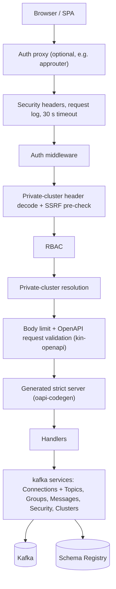

# Architecture

kafkito is one Go binary that serves the React SPA (embedded via
`//go:embed`) and the JSON API under `/api/v1`. It keeps no state of its own:
cluster definitions come from the config file or, for private clusters, from
each request. The stack is described in [ADR-0002](adr/0002-tech-stack.md),
the HTTP contract in [ADR-0005](adr/0005-openapi-contract.md), and the API
from a client's point of view in the [API reference](API.md).

## Request flow

The router is wired in `internal/server/server.go`; `internal/server/api_routes.go`
mounts each generated operation on the middleware chain it needs.

- **Auth** validates the bearer token on every `/api/v1/*` request according
  to `KAFKITO_AUTH_MODE` and answers `401` otherwise; `/healthz` and
  `/readyz` are open. The modes are listed in the
  [README](https://github.com/FinkeFlo/kafkito/blob/main/README.md#quickstart)
  and the [API reference](API.md#base-url-and-auth).
- **RBAC** (`internal/rbac`, `internal/server/rbac.go`) maps the matched
  route pattern and method to a `type:action` permission and checks the
  resource name against prefix-glob rules (`*`, `team-*`, or an exact name).
  Path parameters are percent-decoded exactly once, the same way the
  generated binding decodes them, so RBAC and the handler always see the same
  name. The topic, group, consumer, schema subject and SCRAM user lists are
  filtered to what the caller may view.
- **Handlers** implement the generated `StrictServerInterface` and talk to
  the kafka layer through small interfaces (`internal/server/stores.go`).
  `internal/kafka` has one `Connections` core (configs, lazily created
  franz-go clients, ad-hoc clusters) and one service per resource:
  `Topics`, `Groups`, `Messages`, `Security` and `Clusters`.

## Errors

Handlers return errors; one `errorWriter` (`internal/server/apierror.go`)
turns them into responses. Domain sentinel errors (`ErrUnknownCluster`,
`ErrTopicNotFound`, `ErrValueMasked`, …) map to an `apiError` with a fixed
status, code and message; everything else becomes an opaque `500`, and broker
or Schema Registry failures a generic `502 kafka_upstream`. The body is always
`{"error": "...", "code": "..."}` (code optional). Only 5xx causes are logged,
server-side. Messages are static texts or name the failed rule, never the
submitted value, so they never contain credentials or the raw
`X-Kafkito-Cluster` header.

## OpenAPI as the contract

`api/openapi.yaml` is the single source of truth
([ADR-0005](adr/0005-openapi-contract.md)). `make api-generate` derives the
Go strict server (`internal/server/api/server.gen.go`, oapi-codegen) and the
frontend types (`frontend/src/lib/api.gen.ts`, openapi-typescript);
`make api-check` lints the spec and fails on drift. The same embedded
document drives request validation, and CI rejects breaking changes against
the base branch.

## Frontend data layer

`frontend/src/lib/api-client.ts` is an openapi-fetch client over the
generated types. A single `onRequest` middleware sets `X-Kafkito-Cluster` for
private clusters and `X-Kafkito-Confirm-Prod` for confirmed writes. Reads go
through TanStack Query `queryOptions()` factories in `src/lib/queries/`;
`src/__checks__/query-keys.test.ts` fails on query keys defined anywhere
else. Layout and UI rules are in the [design guidelines](DESIGN_GUIDELINES.md).

## Reading records

Consume, search and the raw download share one iterator,
`Messages.scanRecords` (`internal/kafka/record_source.go`), which reads the
requested offset ranges poll by poll. On topics with a `data_masking` rule the
full decoded value is masked before it is truncated to the 64 KB preview,
search matches the masked value, and a raw download of a value the rules
change is refused with `403 value_masked`.

## Outbound connections (SSRF guard)

Private clusters point kafkito at user-supplied hosts. `internal/netguard`
guards them twice: a pre-check rejects broker and Schema Registry hosts that
resolve to loopback, link-local (including the cloud metadata endpoint),
multicast or unspecified addresses, and a guarded dialer re-checks every
resolved address at connect time, so DNS rebinding between check and dial
cannot reach them. Private network ranges stay allowed. Configured clusters
are trusted and not guarded.

## Security headers

Every response carries a strict Content-Security-Policy (`'self'` only, no
inline scripts or styles), `X-Content-Type-Options`, `Referrer-Policy`,
`Cross-Origin-Opener-Policy` and, unless framing is allowed,
`X-Frame-Options` (`internal/server/secheaders.go`). The exact values and the
`frame_ancestors` setting are in the
[README](https://github.com/FinkeFlo/kafkito/blob/main/README.md#security-headers).

## Private clusters

- Clusters a user adds in the UI live only in that browser's localStorage,
  under `kafkito.private-clusters.v1`, **credentials in plaintext**.
- The SPA sends the definition base64-encoded in `X-Kafkito-Cluster` on every
  request for the path segment `__private__`. The server validates it and
  persists nothing; it only keeps the Kafka client in memory until it has
  been idle for 15 minutes. The raw header and its credentials never appear
  in logs, error bodies or validation messages.
- RBAC does not apply; the broker's own ACLs do.
- Anyone who can run script in the page can read them, which is why the CSP
  is strict. On a shared machine, other users of the same browser profile
  can read them too.
- Users can export and import their clusters as JSON (the export contains
  the passwords).
- The storage format is kept stable: `private-clusters-v1-compat.test.ts`
  and the `private-cluster-storage` e2e walk pin the stored shape.

## Further reading

- [API reference](API.md) and the
  [OpenAPI document](https://github.com/FinkeFlo/kafkito/blob/main/api/openapi.yaml)
- [Design guidelines](DESIGN_GUIDELINES.md)
- [Contributing](contributing.md): local checks, API changes, releases
- Architecture decisions: [ADR-0001](adr/0001-greenfield-apache2.md) to
  [ADR-0005](adr/0005-openapi-contract.md)
