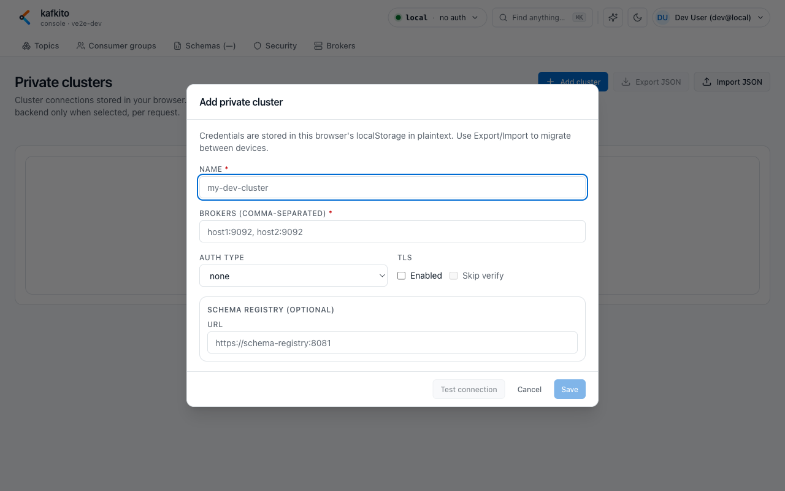
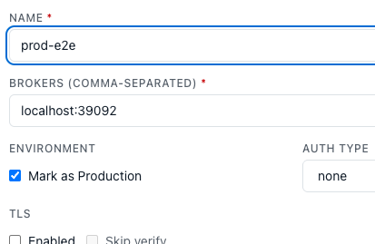

# Add cluster (Private clusters)

This page shows how to add a **Private cluster** in the UI. API-level details are documented separately in the [API reference](../API.md).

## Flow: create a cluster connection

**What do I see?**  
Under **Settings → Private clusters**, you get a table of browser-local cluster connections and an **Add cluster** button.

**What can I do?**  
1. Open **Add cluster**.  
2. Enter `Name` and `Brokers (comma-separated)`.  
3. Choose `Auth type` (`none`, `SASL/PLAIN`, `SCRAM-SHA-256`, `SCRAM-SHA-512`).  
4. For auth types other than `none`, provide username/password.  
5. Optionally mark the cluster as **Production**.  
6. Optionally configure `TLS` and `Skip verify`.  
7. Optionally configure **Schema Registry** (URL + optional credentials/TLS).  
8. Run **Test connection**, then **Save**.

**When should I use this?**  
Use this when your cluster is not configured server-side or when you want to work with your own credentials.

## Expected result after save

**What do I see?**  
The cluster appears in **Private clusters**, in the cluster selector, and in Fleet overview with `PRIVATE` tag.

**What can I do?**  
1. Select it and start working in Topics, Groups, and Brokers.  
2. Use **Export JSON** to back up cluster configs.  
3. Use **Import JSON** to move them to another device/browser.

**When should I use this?**  
Use this for cross-device migration or sharing connection configs within your team.

## Common pitfalls

**What do I see?**  
Connection test/save errors or missing availability in certain tabs (for example Schemas).

**What can I do?**  
1. **First test is slow/timeout**: on cold DNS, first probe can be slow; retry is often much faster.  
2. **Schemas unavailable**: without Schema Registry URL, Schemas cannot be used. Configure SR in cluster settings.  
3. **Auth failure**: verify `Auth type` matches broker setup and credentials are complete.  
4. **Produce warning on prod**: if a cluster is marked as Production, producing a message requires an extra confirmation step.  
5. **Name conflicts**: if a private cluster has the same name as a shared cluster, shared cluster wins in selector. Use distinct names.  
6. **Delete is local**: deleting removes the entry only from the current browser. Export before deleting if needed.

**When should I use this?**  
Use this when connectivity behaves unexpectedly or a newly added cluster is not usable as expected.

## Security note

Private-cluster credentials are stored in your browser and sent to backend only for requests targeting the selected private cluster. Export files include the same data.
