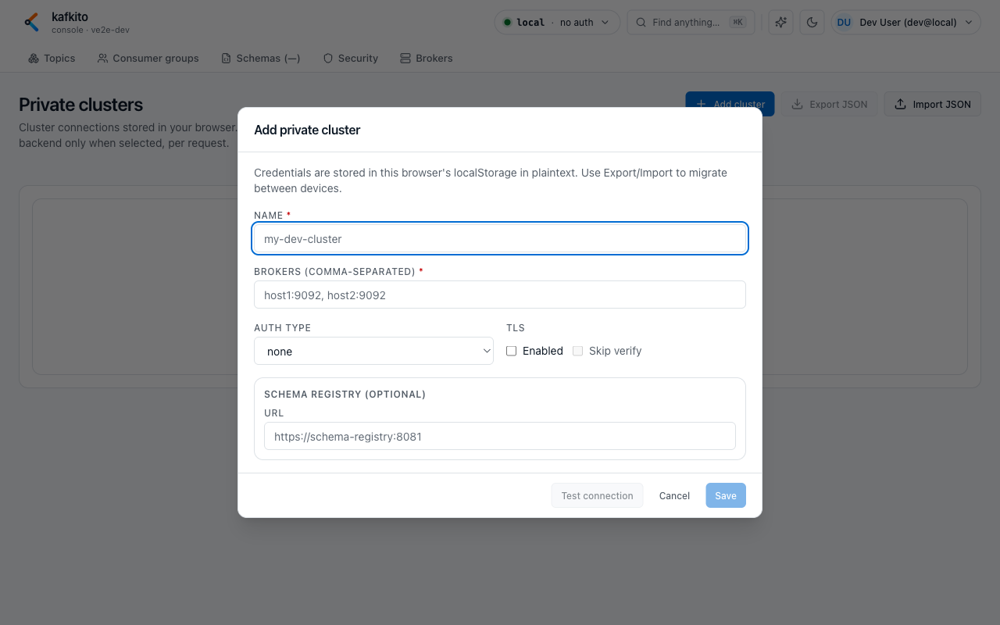
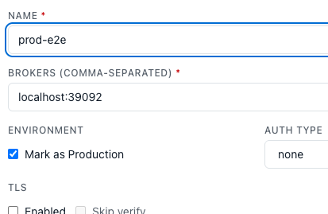
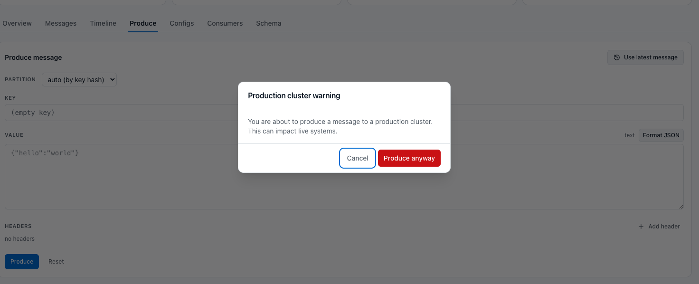

# Add cluster (Private clusters)

This page shows how to add a **Private cluster** in the UI. API-level details are documented separately in the [API reference](../API.md).

## Availability

Operators can disable private clusters or restrict them to a role (`private_clusters.mode`, see [Configuration](https://github.com/FinkeFlo/kafkito/blob/main/README.md#configuration)). When your account may not use them, **Settings → Private clusters** shows a notice ("Private clusters are disabled on this server." or "Your role does not allow private clusters."), **Add cluster**, **Import JSON** and **Test connection** are disabled, and private clusters are hidden from the cluster selector and Fleet overview. Entries saved in your browser are kept; you can still edit, export or delete them.

## Flow: create a cluster connection

**What do I see?**  
Under **Settings → Private clusters**, you get a table of browser-local cluster connections and an **Add cluster** button.

**What can I do?**  
1. Open **Add cluster**.  
2. Enter `Name` and `Brokers (comma-separated)`, at most 50 brokers.  
3. Choose `Auth type` (`none`, `SASL/PLAIN`, `SCRAM-SHA-256`, `SCRAM-SHA-512`).  
4. For auth types other than `none`, provide username/password.  
5. Optionally mark the cluster as **Production**.  
6. `TLS` is on by default. The form warns when it is off (all data, and with `SASL/PLAIN` also the username and password, travels in cleartext) and when `Skip verify` turns off the broker certificate check.  
7. Optionally configure **Schema Registry** (URL + optional credentials/TLS).  
8. Run **Test connection**, then **Save**.

**When should I use this?**  
Use this when your cluster is not configured server-side or when you want to work with your own credentials.

## Expected result after save

**What do I see?**  
The cluster appears in **Private clusters**, in the cluster selector, and in Fleet overview with `PRIVATE` tag.

**What can I do?**  
1. Select it and start working in Topics, Groups, and Brokers.  
2. Use **Export JSON** to back up cluster configs. Kafkito asks for a passphrase (at least 12 characters) and encrypts the file with it. The file cannot be opened without the passphrase, and Kafkito cannot recover a lost one.  
3. Use **Import JSON** to move them to another device/browser. For an encrypted file, enter the passphrase it was exported with. Unencrypted files from older versions still import; export again to get an encrypted copy.

**When should I use this?**  
Use this for cross-device migration or sharing connection configs within your team.

## Common pitfalls

**What do I see?**  
Connection test/save errors or missing availability in certain tabs (for example Schemas).

**What can I do?**  
1. **First test is slow/timeout**: on cold DNS, first probe can be slow; retry is often much faster.  
2. **Generic error texts**: a failed test only says what went wrong: `connection refused`, `connection timed out`, `host name could not be resolved`, `TLS handshake failed`, `authentication failed`, `destination not allowed` or `broker not reachable`. A rejected broker is named by its position in your list (`broker 2: ...`), not by its address. Your operator finds the full error in the server log.  
3. **Too many tests**: you can run **Test connection** 10 times in a row, then once every 6 seconds. Beyond that the test shows `HTTP 429: too many requests`; wait a few seconds and run it again.  
4. **Schemas unavailable**: without Schema Registry URL, Schemas cannot be used. Configure SR in cluster settings.  
5. **Auth failure**: verify `Auth type` matches broker setup and credentials are complete.  
6. **Produce warning on prod**: if a cluster is marked as Production, producing a message requires an extra confirmation step.  
7. **Name conflicts**: if a private cluster has the same name as a shared cluster, shared cluster wins in selector. Use distinct names.  
8. **Delete is local**: deleting removes the entry only from the current browser. Export before deleting if needed.

**When should I use this?**  
Use this when connectivity behaves unexpectedly or a newly added cluster is not usable as expected.

## Security note

Private-cluster credentials are stored unencrypted in your browser's localStorage and sent to backend only for requests targeting the selected private cluster. Export files include the same data, encrypted with the passphrase you choose.

The credentials travel in a request header, so only add a private cluster when kafkito is served over HTTPS (see [Running behind TLS](../architecture.md#running-behind-tls)).

Messages you produce or copy through kafkito carry your user identity, often your e-mail address, in the `X-Kafkito-User` record header, on private clusters too. Everyone who can read the topic sees it for as long as the cluster keeps the record.
