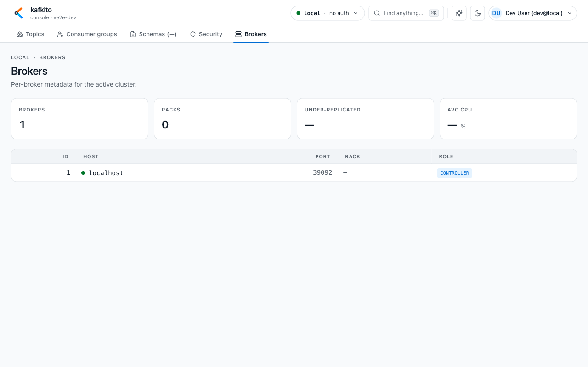
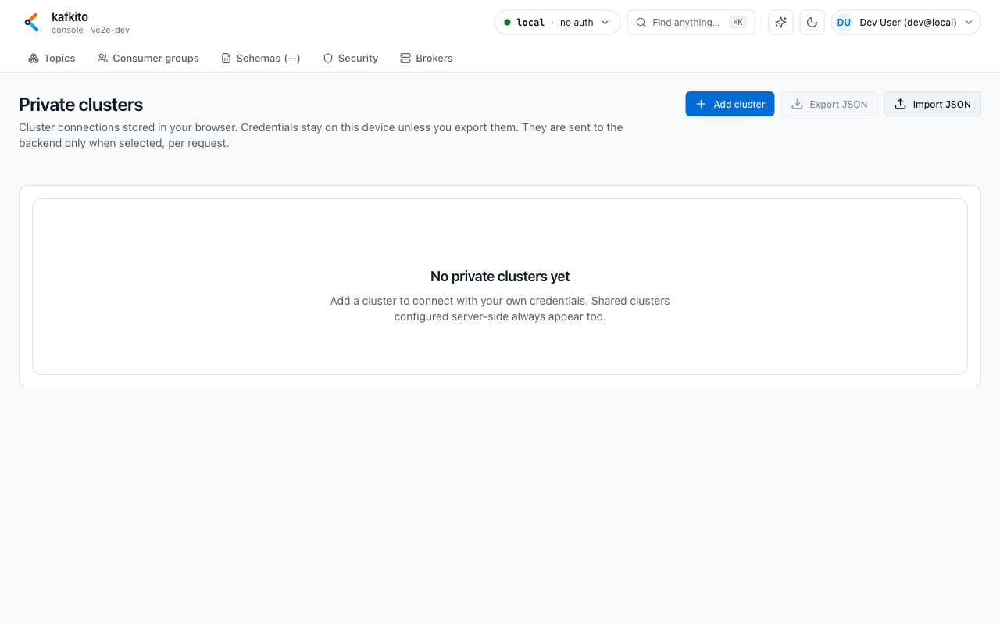
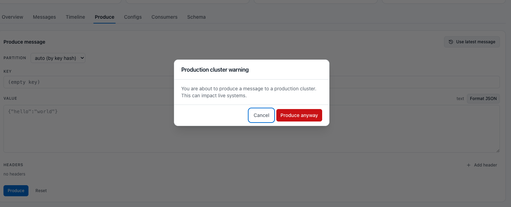

# Features overview

This overview maps UI capabilities by area. For endpoint-level details, use the [API reference](../API.md).

| Area | What do I see? | What can I do? | When should I use it? |
| --- | --- | --- | --- |
| **Clusters / Fleet overview** | Cluster list with reachability, security tags (`TLS`, `SR`, `PRIVATE`, `PROD`, `LIMITED`), and KPI cards | Select clusters, compare status, and open detail areas | Start-of-day checks and multi-cluster status review |
| **Topics** | Filterable topic table with partitions, RF, messages, rate, lag | Search topics, open topic detail, create topics (if allowed) | Topic-level producer/consumer analysis |
| **Topic detail** | Tabs: Overview, Messages, Timeline, Produce, Configs, Consumers, Schema | Browse/search messages, inspect time trends, produce test messages, view consumers (with production confirmation when cluster is marked PROD) | Operational analysis of a single topic |
| **Consumer groups** | Group list with state, members, topics, lag, plus detail panel with members/offsets | Check lag, understand partition offsets, reset offsets, delete group (Empty/Dead only) | Consumer troubleshooting, rebalance analysis, backlog triage |
| **Schemas** | Subject list, version status, schema detail with references/compatibility | Browse subjects, inspect versions, soft-delete subject | Validate payload structures and registry status |
| **Security** | Tabs for ACLs and SCRAM users | Create/delete ACL rules, create/rotate/delete SCRAM users | Access-control troubleshooting and security operations |
| **Brokers** | Broker metadata (ID, host, port, rack, controller) and baseline KPIs | Verify broker topology and role assignment | Cluster infrastructure checks |
| **Settings / Private clusters** | Browser-local cluster connections with auth/TLS/SR config | Add, test, edit, delete clusters; import/export JSON | Personal cluster access without server-side config |

## Current UI boundaries

**What do I see?**  
Some controls are intentionally visible but not yet active (*coming soon*), such as parts of schema evolution and placeholder filters.

**What can I do?**  
Use the active tabs for core operations and switch to the [API reference](../API.md) for deeper automation.

**When should I use this?**  
Use this when a feature appears in UI but is intentionally unavailable today.

## Screenshot samples (local Docker Kafka)

