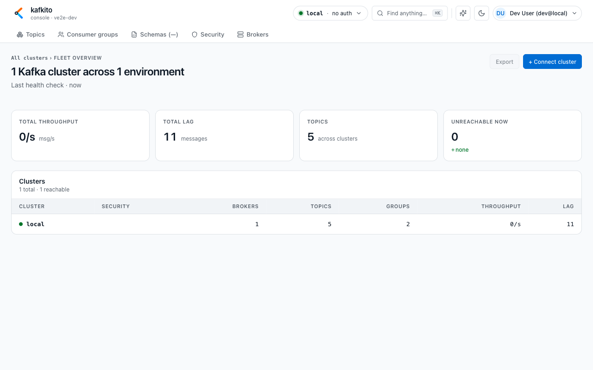
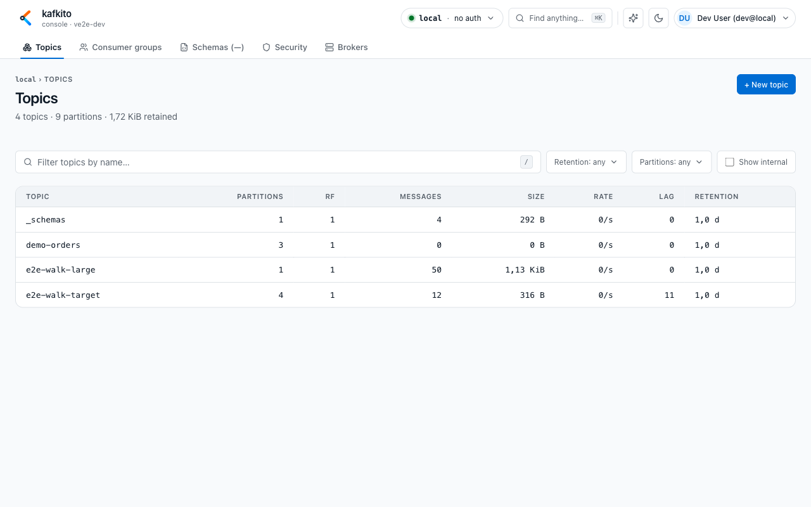

# Getting started in the UI

This page gives you the fastest practical entry into the **kafkito** UI. For endpoint and payload details, use the [API reference](../API.md).

## 1. Initial orientation

**What do I see?**  
At the top, you get the header with cluster selector (**ClusterPill**), search (**Find anything…** / `⌘K`), theme switch, and main navigation.

**What can I do?**  
1. Switch the active cluster from the cluster selector.  
2. Use `⌘K` to jump directly to Topics, Consumer groups, Schemas, Security, or Brokers.  
3. Open **Manage clusters…** to configure Private clusters.

**When should I use this?**  
Use this as your default starting point when switching clusters or jumping to a specific resource quickly.

## 2. Understand Fleet overview

**What do I see?**  
Under **/clusters**, you see **Fleet overview** with KPI cards and the cluster table (reachability and security tags such as `TLS`, `SR`, and `PRIVATE`).

**What can I do?**  
1. Compare cluster status (reachable vs. unreachable).  
2. Open a cluster from its row.  
3. Add private clusters via **+ Connect cluster**.

**When should I use this?**  
Use it to understand which clusters are currently available and where to continue operational work.

## 3. Enter a cluster workspace

**What do I see?**  
After selecting a cluster, the main areas are: **Topics**, **Consumer groups**, **Schemas**, **Security**, and **Brokers**.

**What can I do?**  
1. **Topics**: browse topics and use detail tabs (Overview, Messages, Timeline, Produce, Configs, Consumers, Schema).  
2. **Consumer groups**: inspect status, lag, members, and offsets.  
3. **Schemas/Security/Brokers**: review registry subjects, ACL/SCRAM users, and broker metadata.

**When should I use this?**  
Use this whenever you move from fleet-level status to cluster-level diagnostics or changes.

## 4. Important usage notes

**What do I see?**  
Some actions are intentionally disabled (for example, schema registration in UI), and some views depend on rights/capabilities.

**What can I do?**  
1. Read notices and warning banners (for example missing rights on `GROUP:*` or `CLUSTER:*`).  
2. If Schemas is unavailable, follow the link to **Manage clusters** and configure Schema Registry.  
3. For automation or scripting needs, use the [API reference](../API.md).

**When should I use this?**  
Use this when expected UI functionality is unavailable, disabled, or data does not load.
