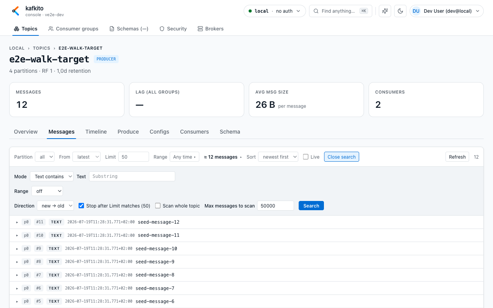
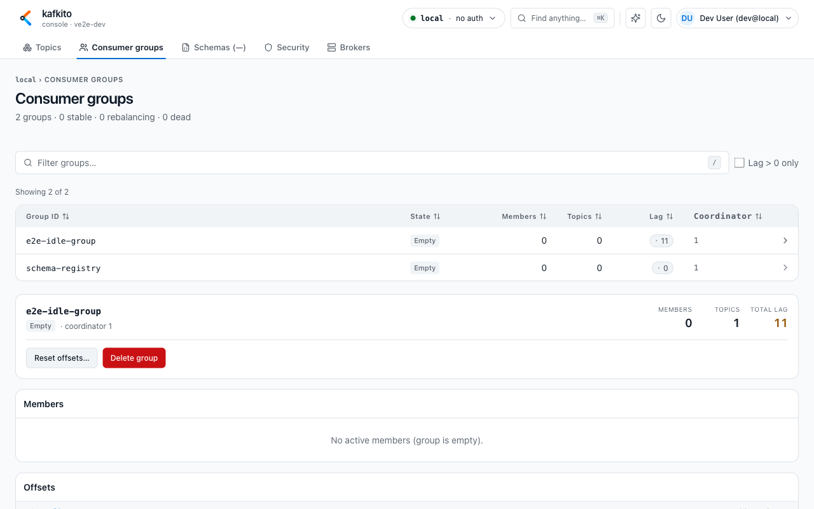
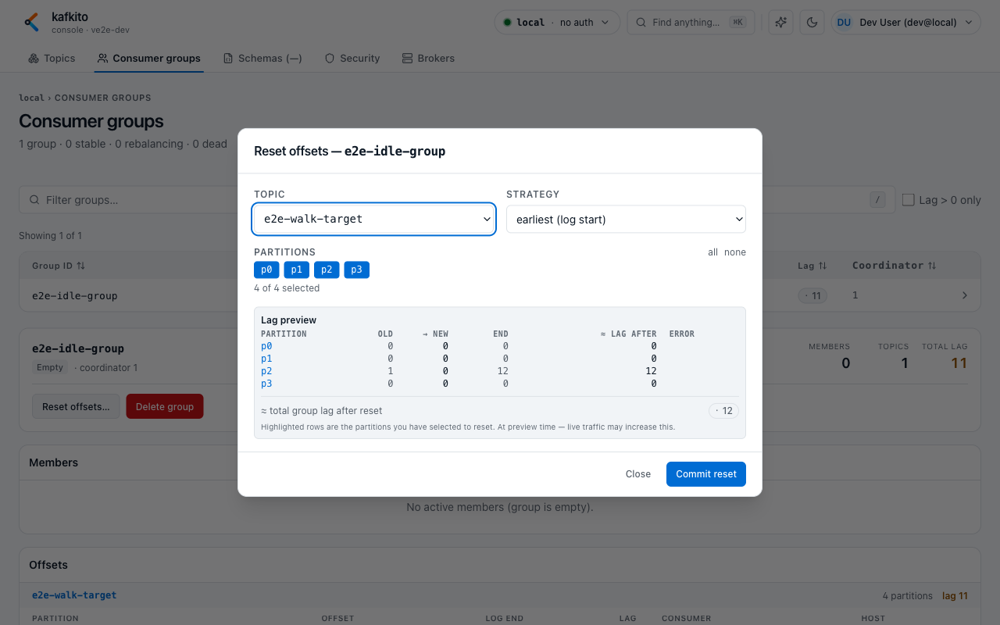
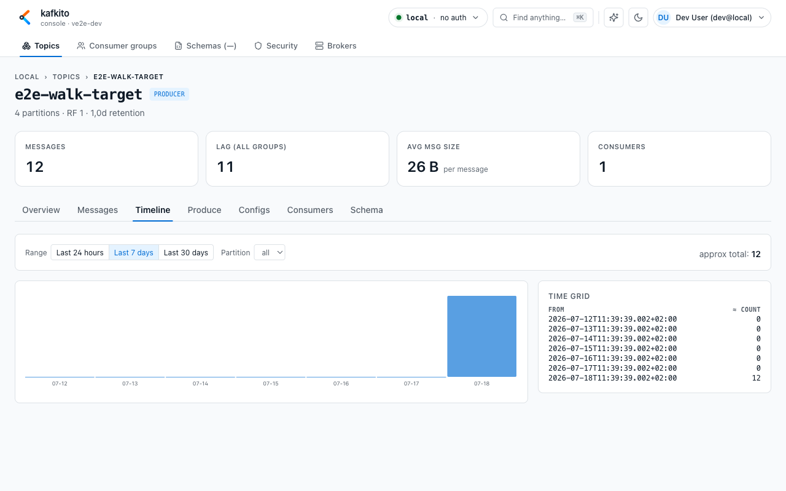

# Typical UI workflows

## Workflow 1: Find a message in a topic

**What do I see?**  
In the topic **Messages** tab: partition, start-point, limit, range controls, and the **Search** panel.

**What can I do?**  
1. Open **Topics → \<topic\> → Messages**.  
2. Optionally scope partition, set `From` (`latest`, `oldest`, `offset`), and choose a range.  
3. Open **Search**.  
4. Use `Mode = Text contains` for quick searches, or switch to `JSONPath`, `XPath`, or `JavaScript`.  
5. Enter search value and run **Search**.  
6. Use **Search more →** when scanning larger ranges.

**When should I use this?**  
Use it to find specific IDs, header patterns, or payload fields in live or historical streams.

**Expected result**  
You get matching records with partition/offset/timestamp and can inspect payload immediately.

---

## Workflow 2: Check and narrow down consumer lag

**What do I see?**  
Under **Consumer groups**, you see a group list (`State`, `Members`, `Topics`, `Lag`) and a detail panel for selected group.

**What can I do?**  
1. Open **Consumer groups**.  
2. Filter by group ID or enable `Lag only`.  
3. Select a group to open details.  
4. In **Offsets**, compare `Offset`, `Log end`, and `Lag` per topic/partition.  
5. Jump to affected topic directly from detail links.

**When should I use this?**  
Use it when backlog grows or it is unclear whether lag is localized or widespread.

**Expected result**  
You can identify whether lag is global or concentrated in specific topics/partitions.

---

## Workflow 3: Understand offsets by cross-checking Messages

**What do I see?**  
In group detail, committed offsets per partition; in topic **Messages**, the `offset` start mode.

**What can I do?**  
1. In **Consumer groups**, open the affected group and note lagging partition/offset context.  
2. Open the linked topic and go to **Messages**.  
3. Set `From = offset` and enter the offset you want to inspect.  
4. Select matching partition (or `all` for broader comparison).  
5. Review records around that offset.

**When should I use this?**  
Use it when you need to translate lag numbers into concrete records before/after consumer position.

**Expected result**  
You can connect abstract lag metrics to specific message context for troubleshooting.

---

## Workflow 4: Set or reset committed consumer offsets

**What do I see?**  
In **Consumer groups** detail, you get the **Reset offsets…** action (enabled only for `Empty`/`Dead` groups) and a modal with strategy + partition selection.

**What can I do?**  
1. Open **Consumer groups** and select the target group.  
2. Ensure group state is `Empty` or `Dead` (otherwise reset is blocked).  
3. Click **Reset offsets…**.  
4. Choose `Topic` and `Strategy` (`earliest`, `latest`, `specific offset`, `timestamp`, `shift-by`).  
5. Select partitions to update.  
6. Review **Lag preview** before commit.  
7. Click **Commit reset** and confirm.

**When should I use this?**  
Use it when you intentionally need to replay, skip, or realign consumption for a group.

**Expected result**  
Committed offsets change for selected partitions and group lag is recalculated.

---

## Workflow 5: Check message volume over time (Timeline)

**What do I see?**  
In topic detail **Timeline**, you get a bar chart and time grid with approximate message counts per time slot.

**What can I do?**  
1. Open **Topics → \<topic\> → Timeline**.  
2. Select range preset (`Last 24 hours`, `Last 7 days`, `Last 30 days`).  
3. Optionally scope a specific partition.  
4. Inspect bars and the time grid to see when traffic peaked.

**When should I use this?**  
Use it to answer “when did traffic increase/decrease?” before digging into individual records.

**Expected result**  
You can quickly identify low/high traffic windows and correlate them with lag or incidents.

